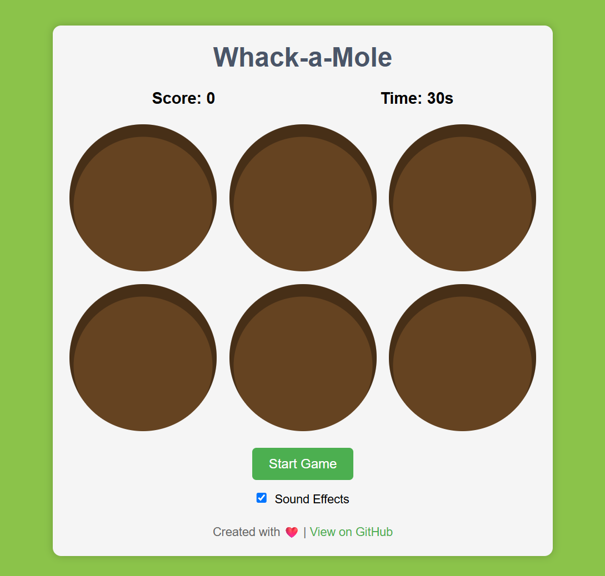

# Whack-a-Mole Game

A simple and fun web-based Whack-a-Mole game built with HTML, CSS, and JavaScript.



## Features

- Classic whack-a-mole gameplay
- Score tracking
- 30-second timer
- Sound effects with toggle option
- Responsive design
- Visual feedback when game ends

## How to Play

1. Click the "Start Game" button to begin
2. Moles will randomly pop up from holes
3. Click on the moles to whack them and earn points
4. Try to get as many points as possible before the 30-second timer runs out
5. When the game ends, your final score will be displayed

## Technologies Used

- HTML5
- CSS3
- JavaScript (ES6)

## Setup and Installation

1. Clone this repository:
   ```
   git clone https://github.com/yourusername/whack-a-mole-game.git
   ```

2. Navigate to the project directory:
   ```
   cd whack-a-mole-game
   ```

3. Open `index.html` in your web browser to play the game.

## Sound Credits

The game uses the following sound effects:
- Whack sound
- Game over sound
- Background music

## License

This project is licensed under the MIT License - see the [LICENSE](LICENSE) file for details.

## Acknowledgments

- Inspired by the classic arcade game
- Built as a learning project for web development
- Special thanks to all open-source contributors

## Future Improvements

- Add difficulty levels
- Implement high score tracking with localStorage
- Add more visual effects and animations
- Create mobile-friendly touch controls
